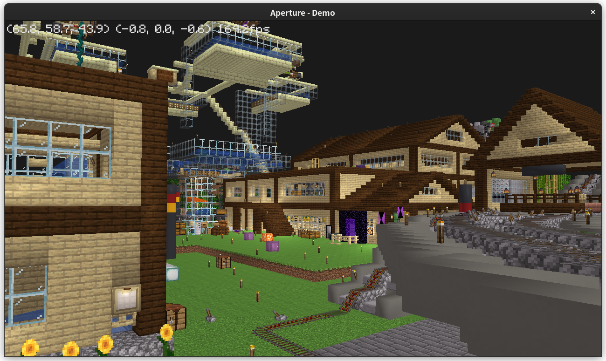
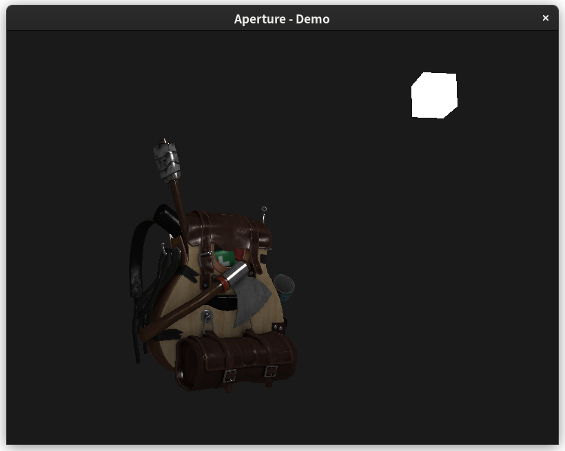

# Aperture - Game Engine

[](https://github.com/STARRY-S/Aperture)

> Current status: Developing...

Aperture: A simple & tiny game engine based on OpenGL ES,
just for learning OpenGL and render stuff, for fun.

Current status (TODOs)
----

- [x] Texture load
- [x] Model import  (Finished, but unstable)
- [x] Lightning stimulation
- [ ] Cross platform:
    - [x] Windows
    - [x] Android (see [Aperture-Android](https://github.com/STARRY-S/GameEngine-Android))
    - [x] Linux
    - [ ] ~~Mac OS~~ (I will add it when I have a Mac)
- [x] Music & Sound engine
- [ ] Network
- [ ] Physic engine
- [ ] GUI tools (User graphics)
- [ ] Database

## Demo

Minecraft model:


Backpack model:


## Usage

### Linux

```
$ git clone https://github.com/STARRY-S/Aperture.git && cd Aperture
$ mkdir build && cd build
$ cmake .. && make -j4
```

### Android

See [Aperture-Android](https://github.com/STARRY-S/Aperture-Android)

### Windows

1. Install [MSYS2](https://www.msys2.org/).
2. Install mingw64 build dependencies.
   ```
   $ pacman -S mingw-w64-x86_64-gcc     # C compiler
   $ pacman -S mingw-w64-x86_64-cmake   # CMake
   $ pacman -S mingw-w64-x86_64-mesa    # OpenGL utils
   $ pacman -S mingw-w64-x86_64-assimp  # Assimp model import library
   $ pacman -S mingw-w64-x86_64-cglm    # C GL Math library
   $ pacman -S mingw-w64-x86_64-glfw    # OpenGL window library
   $ pacman -S mingw-w64-x86_64-ninja   # Ninja
   ```
3. Update the system enviroment, add the `msys64/mingw64/bin` folder to `PATH` variable.
   
4. Clone the source code of this repository, open it in windows powershell,
   ```
   > cd \path\to\the\source\code\
   > mkdir build
   > cd build
   > cmake ..
   > ninja
   ```
5. You can use `cmake -DCMAKE_C_COMPILER=gcc` to specify a C compiler.

## Dependencies

- OpenGL ES 3.0
- cglm
- Assimp
- stb_image
- GLAD
- GLFW
- ffmpeg
- openAL
- freeALUT

The Minecraft OBJ file is generated by [jMc2Obj](https://github.com/jmc2obj/j-mc-2-obj);

## License

The source code of this project is under [Apache 2.0](LICENSE) license.
