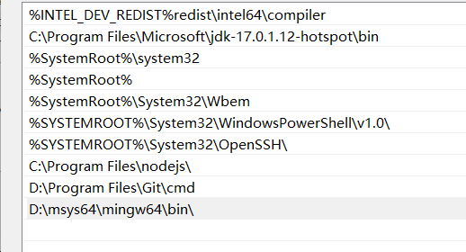

## Aperture

[](https://github.com/STARRY-S/Aperture)

Just for fun.

## Usage

### Arch Linux

```
$ yay -S make cmake git cglm assimp glfw freealut
$ git clone https://github.com/STARRY-S/Aperture.git && cd Aperture
$ mkdir build && cd build
$ cmake .. && make -j4
```

### Android

See [Aperture-Android](https://github.com/STARRY-S/Aperture-Android)

### Windows

1. Install [MSYS2](https://www.msys2.org/).
2. Install mingw64 build dependencies.
   ```
   $ pacman -S mingw-w64-x86_64-gcc mingw-w64-x86_64-cmake \
         mingw-w64-x86_64-mesa     mingw-w64-x86_64-assimp \
         mingw-w64-x86_64-cglm     mingw-w64-x86_64-glfw   \
         mingw-w64-x86_64-ninja    mingw-w64-x86_64-openal \
         mingw-w64-x86_64-freealut mingw-w64-x86_64-ffmpeg
   ```
3. Update the system enviroment, add the `msys64/mingw64/bin` folder to `PATH` variable.
   
4. Clone the source code of this repository, open it in windows powershell,
   ```
   > cd \path\to\the\source\code\
   > mkdir build
   > cd build
   > cmake ..
   > ninja
   ```
5. You can use `cmake -DCMAKE_C_COMPILER=gcc` to specify a C compiler.

## Dependencies

- OpenGL ES 3.0
- cglm
- Assimp
- stb_image
- GLAD
- GLFW
- ffmpeg
- openAL
- freeALUT

The Minecraft OBJ file is generated by [jMc2Obj](https://github.com/jmc2obj/j-mc-2-obj);

Font: https://www.fontspace.com/roboto-remix-font-f26577

## License

The source code of this project is under [Apache 2.0](LICENSE) license.
