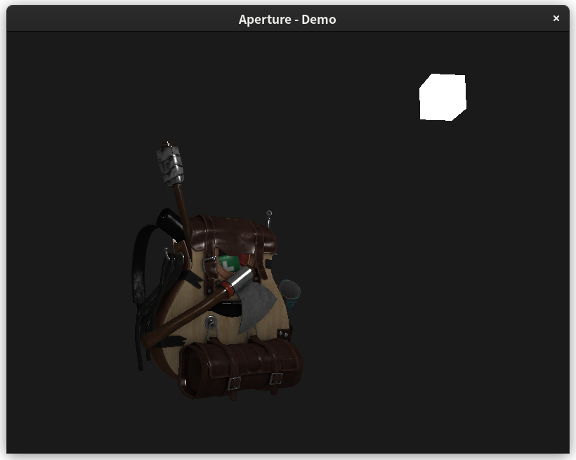

Aperture - Game Engine
====

[](https://github.com/nikku/works-on-my-machine)

> Current status: Developing...

Aperture: A simple & tiny game engine based on OpenGL ES,
just for learning OpenGL and render stuff, for fun.

Current status (TODOs)
----

- [x] Texture load
- [x] Model import  (Finished, but unstable)
- [x] Lightning stimulation
- [ ] Cross platform:
    - [ ] Windows
    - [x] Android (see [Aperture-Android](https://github.com/STARRY-S/GameEngine-Android))
    - [x] Linux
    - [ ] ~~Mac OS~~
    - [ ] ~~IOS~~
- [ ] Music & Sound engine
- [ ] Network (socket)...
- [ ] Physic engine
- [ ] GUI tools (User graphics)
- [ ] Database

Demo
----



Usage
----

### Linux

```
$ git clone https://github.com/STARRY-S/GameEngine.git && cd GameEngine
$ mkdir build && cd build
$ cmake .. && make -j4
```

### Android

See [GameEngine-Android](https://github.com/STARRY-S/GameEngine-Android)

Dependencies
----

- OpenGL ES 3.0
- cglm
- Assimp
- stb_image

License
----

> [Apache 2.0](LICENSE)