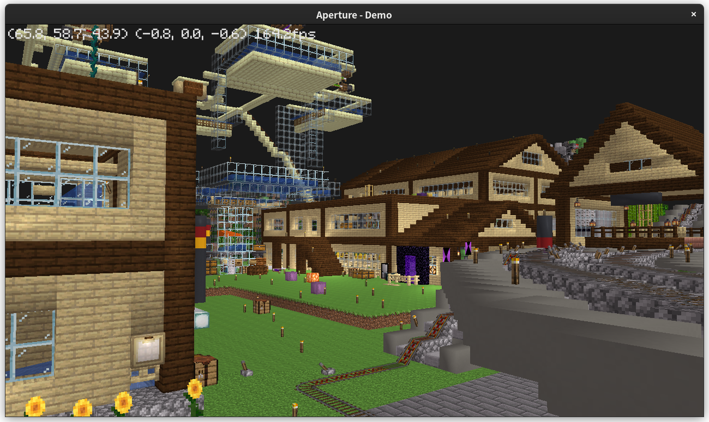
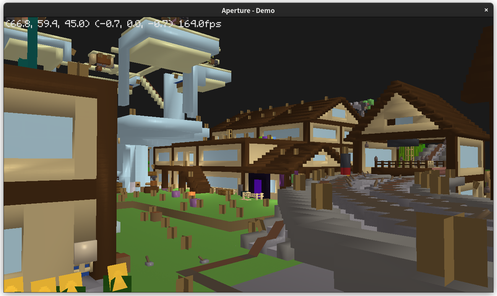
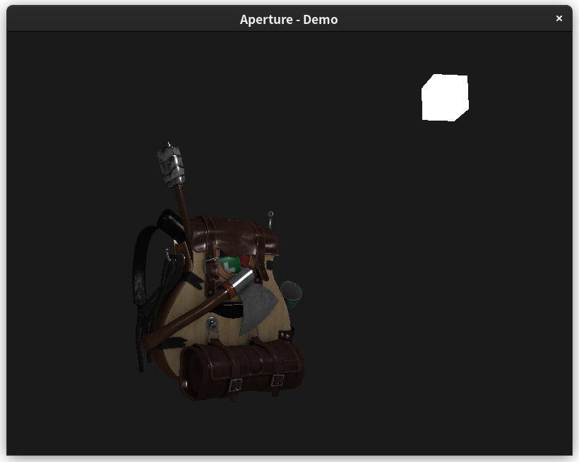
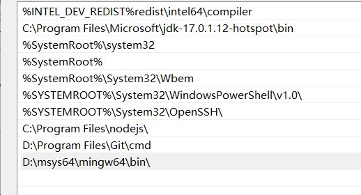

# Aperture - Game Engine

[](https://github.com/STARRY-S/Aperture)


Aperture: A simple & tiny game engine based on OpenGL ES,
just for learning OpenGL and render stuff, for fun.

Current status (TODOs)
----

- [x] Texture load
    - [x] PNG & JPEG format image by using stb_image.
    - [x] Convert a single RGBA color value to a texture image supported.
    - [x] Diffuse texture
    - [x] Specular texture
    - [ ] Normal texture
- [x] Model import
- [x] Lightning stimulation
    - [x] Directional light
    - [x] Point lights
    - [x] Spot lights
- [ ] Cross platform:
    - [x] Linux
    - [x] Windows
    - [x] Android (see [Aperture-Android](https://github.com/STARRY-S/Aperture-Android))
    - [ ] ~~Mac OS~~ (I will add it when I have a Mac machine)
- [x] Music & Sound engine:
    - [x] WAV format audio decode by freeALUT.
    - [x] MP3 format audio decode by FFMpeg.
    - [x] Audio playback by using OpenAL.
- [x] Font rendering
    - [x] FreeType2 font rendering in Orthographic shader.
    - [x] Custom font file (TTF) supported.
- [ ] Network
- [ ] Physic engine (WIP)
    - [ ] Collision detection (WIP)
    - [x] Gravaty
    - [x] Jumping
    - [ ] hit
- [ ] GUI tools (User graphics)
    - [x] Orthographic shader program
    - [x] Font rendering
- [ ] Database:
    - [x] SQLite Database

## Demo

Minecraft model:




Backpack model:


## Usage

### Linux

Install required dependencies by using the package manager on your system.

``` sh
# For ArchLinux
sudo pacman -S \
    cmake make gcc \
    glfw-x11 assimp ffmpeg \
    openal freealut freetype2
```

Then clone this repository and build it.

``` sh
$ git clone https://github.com/STARRY-S/Aperture.git && cd Aperture
$ mkdir build && cd build
$ cmake .. && make -j4
$ ./aperture_demo -h
```

### Android

See [Aperture-Android](https://github.com/STARRY-S/Aperture-Android).

### Windows

1. Install [MSYS2](https://www.msys2.org/).
2. Install mingw64 build dependencies.
   ```
   $ pacman -S mingw-w64-x86_64-gcc mingw-w64-x86_64-cmake \
         mingw-w64-x86_64-mesa     mingw-w64-x86_64-assimp \
         mingw-w64-x86_64-cglm     mingw-w64-x86_64-glfw   \
         mingw-w64-x86_64-ninja    mingw-w64-x86_64-openal \
         mingw-w64-x86_64-freealut mingw-w64-x86_64-ffmpeg
   ```
3. Update the system enviroment, add the `msys64/mingw64/bin` folder to `PATH` variable.
   
4. Clone the source code of this repository, open it in windows powershell,
   ```
   > cd \path\to\the\source\code\
   > mkdir build
   > cd build
   > cmake ..
   > ninja
   > .\aperture_demo -h
   ```
5. You can use `cmake -DCMAKE_C_COMPILER=gcc` to specify a C compiler.

## Dependencies

- OpenGL ES 3.0
- cglm
- Assimp
- stb_image
- GLAD
- GLFW
- ffmpeg
- openAL
- freeALUT
- FreeType2

The Minecraft OBJ file is generated by [jMc2Obj](https://github.com/jmc2obj/j-mc-2-obj);

Font: https://www.fontspace.com/roboto-remix-font-f26577

## License

The source code of this project is under [Apache 2.0](LICENSE) license.
